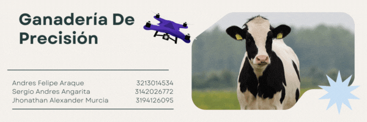

  

# Implementation of Drones in Precision Livestock Farming for Animal Counting and Tracking.

Introducing "AI Precision Livestock Farming," a pioneering solution that revolutionizes livestock management by counting cattle through aerial imagery. Facing low technological adoption due to high costs, our proposal integrates drones and an artificial intelligence model to offer accurate counting, efficiency, and cost reduction. Targeted at livestock farmers, AI Precision Livestock Farming not only transforms the way we count livestock but also alleviates financial burden, optimizes management, and lays the groundwork for a more sustainable future in the livestock industry. Join the revolution!

## Repository Contents

### 1. Database

- **File Name:** `base_datos.py`
- **Description:** 
The project members created this database by taking photographs in various pre-selected areas. Using a drone, 1546 images were captured, which were then labeled and divided into train, validation, and test sets. It is important to note that this dataset has a size of approximately 7 GB, therefore, a link to download the database is provided within the file.

### 2. Algorithms and Code

- **Directory:** `algoritmos prueba ` `models `
- **Description:** In the  `algoritmos prueba ` folder, there are several Colab files containing tests conducted throughout the project, culminating in the two final models. These final models are located in this repository under the names `modelm_yolov8_ganaderia.ipynb` and `modelm_yolov8_ganaderia.ipynb`. Additionally, there is one last file containing results using the selected final model (Yolo V8m), named `Precision_cattle_model_test.ipynb`.

Within the folder named `models `, the final model is available in different formats such as ONX, TFLite, and PyTorch. Furthermore, concerning the algorithms, this repository includes some used to evaluate the selected model, including each of the 5 folds used to assess its performance, along with the file `val_test.ipynb`.

### 3. Project Structure

- **Folder Structure:** 
The repository contains files that include the database used to train the model, as well as each of the algorithms used to train and validate the models. Additionally, tests were conducted to support the selection of the Yolo V8 m model, which will subsequently be used for the mobile application developed during this project. To access the application repository, please use the following link: 

## Usage Instructions

To use the final project, follow these steps:
- Fly over the area containing the cows to be counted and take a photograph in which the cows are visible.
- Export the image from the drone control application to the phone's gallery.
- Open the application developed during this project and import the image from the phone's gallery, selecting the "select image" option.
- From the application, select the "Upload image" option.
- Finally, select "process image", which will return the image with the location of the cows, as well as the number of cows in the image.

## Authors
- Andres Felipe Araque
- Sergio Andres Angarita
- Jhonathan Alexsander Murcia
