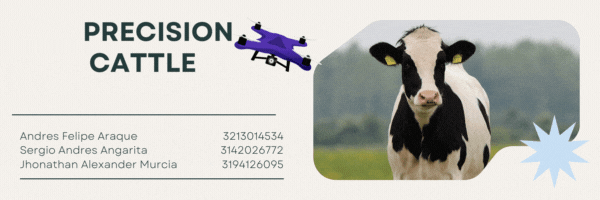

  

# Implementación de Drones en la Ganadería de Precisión para el Conteo y Seguimiento de Animales.

Presentamos "Ganaderia de precisión AI", una solución pionera que revoluciona la gestión ganadera al contar vacunos mediante imágenes aéreas. Enfrentando la baja adopción tecnológica debido a costos elevados, nuestra propuesta integra drones y un modelo de inteligencia artificial para ofrecer conteo preciso, eficiencia y reducción de costos. Dirigido a ganaderos, Ganaderia de precisión AI no solo transforma la forma en que contamos ganado, sino que también alivia la carga financiera, optimiza la gestión y sienta las bases para un futuro más sostenible en la industria ganadera. ¡Únete a la revolución!

## Contenido del repositorio

### 1. Base de Datos

- **Nombre del Archivo:** `base_datos.py`
- **Descripción:** Los integrantes del proyecto crearon esta base de datos al tomar fotografías en diversas zonas seleccionadas previamente. Utilizando un dron, se capturaron 1546 imágenes, las cuales fueron etiquetadas y divididas posteriormente en conjuntos de train, validation y test. Es importante destacar que este dataset tiene un tamaño de aproximadamente 7 GB, por lo tanto, se proporciona un enlace en el archivo de la base de datos para su descarga.

### 2. Algoritmos y Código

- **Directorio:** `algoritmos/`
- **Descripción:** Explicación general de los algoritmos utilizados.
- **Instrucciones de Ejecución:** Pasos claros para ejecutar el código. Puedes incluir dependencias y requisitos del entorno.

### 3. Estructura del Proyecto

- **Estructura de Carpetas:** Breve descripción de cómo está organizado el proyecto en el repositorio.

## Instrucciones de Uso

Explica cómo usar y ejecutar tu proyecto paso a paso.

## Autores
- Andres Felipe Araque
- Sergio Andres Angarita
- Jhonathan Alexander Murcia
